# HNG DevOps Stage 1 — deploy.sh

This repository contains `deploy.sh`, a POSIX-friendly Bash script that automates cloning a Git repo (using a PAT), preparing a remote Linux host (Docker, Docker Compose, Nginx), transferring code, building and running the Dockerized app, configuring Nginx as a reverse proxy, validating the deployment, logging, and idempotent redeploys.

## Features implemented
- Interactive prompts for required parameters (repo URL, PAT, branch, SSH user/host/key, app port).
- Clone or pull repo using PAT and checkout branch.
- Detect Dockerfile or docker-compose.yml and deploy accordingly.
- Remote host setup (apt/yum flows supported): install Docker, Docker Compose plugin, Nginx.
- Transfer application via `rsync` (excludes `.git`).
- Build/run containers (docker build/run OR docker compose up -d --build).
- Configure nginx site in `/etc/nginx/sites-available` and enable via symlink to `/etc/nginx/sites-enabled`.
- Health checks for containers and curl-based HTTP probe.
- Logging to `./logs/deploy_YYYYMMDD_HHMMSS.log`.
- Trap and cleanup routines for local temp files.
- Idempotency: stops/removes old containers before redeploy, overwrites nginx config, uses `--delete` in rsync to sync.
- Optional `--cleanup` mode to remove deployed resources remotely.

## Prerequisites

**Local Machine:**

- Bash / terminal
- Git
- SSH client (`ssh`)
- `rsync` or `scp`
- `curl` for endpoint testing

**Remote Host (Ubuntu/Debian recommended):**

- SSH accessible
- Internet access to download packages
- Optional pre-installed Docker/Nginx (script will install if missing)

## 🏃 How to Run `deploy.sh`

Follow these steps to deploy your Dockerized application using the `deploy.sh` script.

---

### 1. Make the script executable

Before running, ensure the script has execution permissions:

```bash
chmod +x deploy.sh
```

### 2. Run the script for interactive deployment

```bash
./deploy.sh
```

You'll be prompted to provide the following parameters:

| Parameter                   | Description                                           | Example                                |
| --------------------------- | ----------------------------------------------------- | -------------------------------------- |
| Git Repository URL          | HTTPS URL of your repository                          | `https://github.com/username/repo.git` |
| Personal Access Token (PAT) | GitHub personal access token                          | `ghp_xxxxxxx`                          |
| Branch name                 | Branch to deploy (default is `main`)                  | `main`                                 |
| Remote Server Username      | SSH username for the remote host                      | `ubuntu`                               |
| Remote Server IP            | Public IP of the remote host                          | `18.232.12.34`                         |
| SSH Key Path                | Path to your private SSH key                          | `~/.ssh/id_rsa`                        |
| App Internal Port           | Port the application listens on inside the container | `5000`                                 |

> The script automatically clones or updates the repository, prepares the remote environment, transfers files, builds/runs Docker containers, configures Nginx, and validates the deployment.

### 3. Test the deployed application
```bash
curl http://<REMOTE_SERVER_IP>
```
Verify the Docker container is running on remote host:
```bash
ssh -i ~/.ssh/id_rsa ubuntu@<REMOTE_SERVER_IP>
sudo docker ps
```

### 4. Optional: Remove deployed resources (`--cleanup`)

To clean up all deployed resources (stop/remove containers, remove transferred files, and remove Nginx config):
```bash
./deploy.sh --cleanup
```

## 🚀 Deployment Workflow Diagram

```mermaid
flowchart TD
    A[💻 Local Machine] -->|🚀 Run deploy.sh| B[📂 Clone or Pull Git Repository]
    B --> C[🔍 Validate Dockerfile / docker-compose.yml]
    C --> D[🔑 SSH to Remote Server]
    D --> E[⚙️ Prepare Remote Environment]
    E --> F[📤 Transfer Application via rsync]
    F --> G[🐳 Build & Run Docker Container]
    G --> H[🌐 Configure Nginx Reverse Proxy]            
    H --> I[✅ Test Deployment via curl]
    I --> J[📝 Log Deployment Steps]
    J --> K[🏁 Deployment Complete 🎉]

    style A fill:#f9f,stroke:#333,stroke-width:2px
    style K fill:#0f0,stroke:#333,stroke-width:2px
```



<details>
<summary>🚀 Deployment Logs and Troubleshooting (click to expand)</summary>

All deployment logs are saved in ./logs with timestamps:
```bash
deploy_YYYYMMDD_HHMMSS.log
```

Logs include:

- **Step success/failure messages**
- **Container build & run status**
- **Errors during deployment**

###### Troubleshooting tips:
  - **SSH errors:** Ensure your SSH key path is correct and permissions are set:  
    ```bash
    chmod 600 ~/.ssh/id_rsa
    ```
  - **Docker errors:** Check logs on the remote host:  
    ```bash
    docker logs <container_name>
    ```
  - **Nginx Issues:** Test configuration and reload:
    ```bash
    sudo nginx -t
    sudo systemctl reload nginx
    ```

</details>

<details>
<summary>📝 Notes </summary>

- Script is **POSIX-compliant** and safe to rerun multiple times  
- **No external configuration management tools** used (Ansible/Terraform)  

</details>